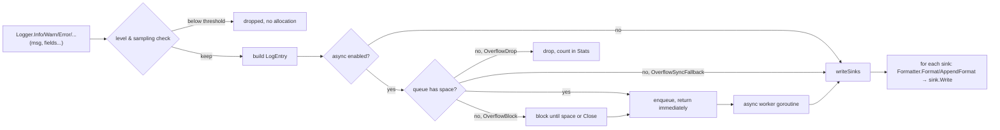

# grlog

A zero-dependency, structured logging library for Go.

[](https://github.com/gourdian25/grlog/actions/workflows/ci.yml)
[](https://pkg.go.dev/github.com/gourdian25/grlog)
[](https://go.dev/)
[](LICENSE)

## Table of Contents

- [Overview](#overview)
- [Features](#features)
- [Installation](#installation)
- [Quick Start](#quick-start)
- [Core Concepts](#core-concepts)
- [Usage Guide](#usage-guide)
- [Configuration](#configuration)
- [Public API Overview](#public-api-overview)
- [Examples](#examples)
- [Architecture](#architecture)
- [Performance](#performance)
- [Thread Safety](#thread-safety)
- [Error Handling](#error-handling)
- [Best Practices](#best-practices)
- [Limitations](#limitations)
- [Repository Structure](#repository-structure)
- [Testing](#testing)
- [Contributing](#contributing)
- [Versioning](#versioning)
- [License](#license)
- [Related Packages](#related-packages)

## Overview

grlog is a leveled, structured logging library for Go with pluggable output
destinations (sinks) and formats, an asynchronous mode for latency-sensitive
call sites, and a `log/slog` adapter. It has no third-party dependencies —
everything is built on the standard library.

The library exists because the two things applications usually want from a
logger — a small, typed API for structured fields, and a genuinely
allocation-free hot path — are often in tension. grlog resolves that by
passing structured data as typed `Field` values (not `map[string]interface{}`)
and reusing pooled buffers for formatting, so both field construction and
output formatting avoid reflection and allocation on their common paths.

**Use grlog when** you want leveled, structured logging with control over
where entries go (stdout, a rotating file, both, a custom destination) and
how they're formatted (plain text or JSON), without pulling in a dependency
tree, and where the hot-path allocation behavior of the logging call itself
matters.

**Don't reach for grlog when** you need a logger with a large ecosystem of
pre-built third-party sinks (Kafka, Elasticsearch, Datadog, ...) out of the
box — grlog gives you the `LogSink`/`CustomSink` seam to build those
yourself, but ships none of them. Its own words: no built-in redaction of
sensitive fields, no network/database sinks, no metrics or tracing — see
[Limitations](#limitations).

## Features

- Six log levels: `DEBUG`, `INFO`, `WARN`, `ERROR`, `FATAL`, plus `OFF` to
  disable output — changeable at runtime via a lock-free atomic
- Typed field constructors (`String`, `Int`, `Int64`, `Uint64`, `Float64`,
  `Bool`, `Duration`, `Time`, `Err`, `Any`) with zero-allocation construction
  for the common types
- Pluggable sinks: `WriterSink`/`StdoutSink`, `FileSink` (size-based
  rotation, optional gzip compression, age-based backup cleanup),
  `MultiSink` (fan-out), `LeveledSink` (per-destination severity filter),
  `CustomSink` (arbitrary write/close functions)
- Pluggable formatters: `PlainFormatter` (human-readable text) and
  `JSONFormatter` (deterministic key order, reserved-key collision
  handling), both using pooled buffers to avoid per-entry allocation
- Asynchronous logging with a configurable buffer and an explicit overflow
  policy (`OverflowSyncFallback`, `OverflowBlock`, `OverflowDrop`)
- Sampling for high-volume, low-severity log lines (`WithSampler`)
- `log/slog` interoperability via `NewSlogHandler`
- Caller information (`file:line:function`) with configurable stack-frame
  skipping for wrapper functions
- Context-aware logging via collision-proof typed context keys, plus custom
  extractors for things like OpenTelemetry span IDs
- Derived loggers (`With`, `WithContext`) that share sinks and the async
  worker with their parent, closing exactly once
- Runtime stats (`Logger.Stats()`) for entries dropped or sampled away

## Installation

```bash
go get github.com/gourdian25/grlog
```

```go
import "github.com/gourdian25/grlog"
```

Requires Go 1.26.4+ (the ecosystem-aligned minimum declared in `go.mod`);
the features grlog actually uses — `log/slog` and `errors.Join` — only need
Go 1.21+.

## Quick Start

```go
package main

import "github.com/gourdian25/grlog"

func main() {
	logger := grlog.NewDefaultLogger()
	defer logger.Close() // flushes any buffered output before exit

	logger.Info("server started", grlog.Int("port", 8080))
	logger.Warn("cache miss rate high", grlog.Float64("ratio", 0.42))
	logger.Error("request failed", grlog.Err(someErr))
}
```

`NewDefaultLogger()` writes plain text to stdout at `INFO` level with caller
info enabled — a reasonable default for both local development and
container logs. Runnable versions of this and a fuller production setup
live in [`examples/`](examples/).

## Core Concepts

```
Logger → LogEntry → Formatter → LogSink
```

- **`Logger`** is the entry point. It builds a `LogEntry` for each call
  that passes the level (and sampling) check, then dispatches it to every
  configured sink. A `Logger` returned by `NewLogger`/`NewDefaultLogger` is
  a lightweight view over shared state — see [Architecture](#architecture).
- **`LogEntry`** is the canonical, sink-agnostic representation of one log
  event: timestamp, level, message, `[]Field`, and optional caller info.
- **`Field`** is a typed key/value pair (`FieldType` tags the underlying
  Go type), built by `String`, `Int`, `Err`, and the other constructors.
  Fields replace `map[string]interface{}` specifically to avoid its
  allocation and reflection cost.
- **`Formatter`** turns a `LogEntry` into bytes. `PlainFormatter` and
  `JSONFormatter` are the two built-ins; a sink owns exactly one formatter.
- **`LogSink`** is a write destination (`Write(LogEntry) error`,
  `Close() error`). Multiple sinks can share one formatter or each use a
  different one.

## Usage Guide

### Creating a logger

```go
// Zero-config: stdout, plain text, INFO level, caller info on.
logger := grlog.NewDefaultLogger()

// Fully configured:
logger := grlog.NewLogger(
	grlog.WithLevel(grlog.DEBUG),
	grlog.WithSink(grlog.NewStdoutSink(grlog.JSONFormat())),
	grlog.WithAsync(1000),
	grlog.WithCaller(true),
)
defer logger.Close()
```

If `NewLogger` is called with no `WithSink` option, it installs a
`StdoutSink` with `PlainFormat()` so a logger is always usable.

### Structured logging

```go
logger.Info("payment processed",
	grlog.String("payment_id", id),
	grlog.Int64("amount_cents", 4999),
	grlog.String("currency", "USD"),
	grlog.Duration("processing_time", 42*time.Millisecond),
	grlog.Err(err), // nil-safe: skipped entirely from output when err is nil
)
```

Prefer the typed constructors over `Any`, which falls back to reflection
and is the one field type that isn't allocation-free.

### Sinks

```go
// stdout, or any io.Writer (stderr, a bytes.Buffer in tests, a socket, ...)
stdout := grlog.NewStdoutSink(grlog.PlainFormat())
stderr := grlog.NewWriterSink(os.Stderr, grlog.JSONFormat())

// A rotating file
fileSink, err := grlog.NewFileSink(grlog.FileSinkConfig{
	Filename:    "app",
	Dir:         "/var/log/myapp",
	MaxBytes:    100 * 1024 * 1024,
	BackupCount: 20,
	MaxAge:      30 * 24 * time.Hour,
	Compress:    true,
	Formatter:   grlog.JSONFormat(),
})

// Fan out to several sinks; write errors are aggregated with errors.Join
multi := grlog.NewMultiSink(stdout, fileSink)

// Wrap any sink to drop entries below a minimum level
errorsOnly := grlog.NewLeveledSink(fileSink, grlog.ERROR)

// Arbitrary destinations
custom := grlog.NewCustomSink(func(entry grlog.LogEntry) error {
	return nil // your write logic
})
```

Rotation is crash-safe: backup filenames use nanosecond timestamps plus a
sequence suffix, so rapid rotations can't collide, and if a rotation fails
(rename/reopen error) the sink reopens the current file and keeps writing —
the triggering entry is never lost to a rotation failure.

### Formatters

```go
plain := grlog.PlainFormat() // "2025-12-17 06:45:58.801 [INFO] main.go:42:main msg {k=v}"
json := grlog.JSONFormat()   // {"timestamp":"...","level":"INFO","message":"msg","k":"v"}

// JSON with static fields added to every entry
json := &grlog.JSONFormatter{
	TimestampFormat: time.RFC3339Nano,
	CustomFields: map[string]interface{}{
		"service": "orders-api",
		"version": "1.4.0",
	},
}
```

JSON key order is deterministic: reserved keys (`timestamp`, `level`,
`message`, `caller`) first, then `CustomFields` in sorted order, then entry
fields in call order. An entry field whose key collides with a reserved key
is emitted as `fields.<key>` instead of silently overwriting entry metadata.
Values that fail to marshal degrade to their `%v` string form rather than
discarding the entry.

### Asynchronous logging

```go
logger := grlog.NewLogger(
	grlog.WithAsync(10000),
	grlog.WithOverflowPolicy(grlog.OverflowDrop),
)
defer logger.Close() // drains the queue; no buffered entries are lost
```

A single worker goroutine drains the buffered channel. `WithOverflowPolicy`
picks the behavior once the buffer fills:

| Policy                 | Behavior when full                          | Ordering              |
|------------------------|----------------------------------------------|------------------------|
| `OverflowSyncFallback` (default) | Writes the entry synchronously; nothing is lost | Mostly preserved |
| `OverflowBlock`        | Blocks the caller until space frees           | Strictly preserved     |
| `OverflowDrop`         | Discards the entry; never blocks              | Preserved for kept entries |

Drops are counted in `logger.Stats().DroppedEntries`.

### Context-aware and derived logging

```go
ctx := grlog.ContextWithRequestID(ctx, "req-123")
ctx = grlog.ContextWithTraceID(ctx, "trace-456")
ctx = grlog.ContextWithUserID(ctx, "user-789")

reqLogger := logger.WithContext(ctx) // adds request_id, trace_id, user_id
reqLogger.Info("request handled")

dbLogger := logger.With(grlog.String("component", "database")) // permanent field
```

Context values are read from collision-proof, package-private typed keys —
not raw strings — so they can't collide with another package's context
values. `WithContextExtractor` registers additional extraction logic (e.g.
for OpenTelemetry span IDs).

### Sampling

```go
logger := grlog.NewLogger(
	grlog.WithSampler(100, grlog.INFO), // keep 1 in 100 DEBUG/INFO entries
)
skipped := logger.Stats().SampledEntries
```

The first entry at each level is always kept; levels above `maxLevel` are
never sampled.

### Dynamic sink management

```go
logger.AddSink(newSink)      // safe to call while logging concurrently
logger.RemoveSink(oldSink)
```

Both are copy-on-write under a lock, so a concurrent reader never observes
a partially updated sink list, and the change is visible to every view
derived from the same logger.

### Lifecycle and shutdown

```go
logger := grlog.NewDefaultLogger()
defer logger.Close()
```

`Close()` stops the async worker (if any), drains any buffered entries,
closes every sink, and aggregates close errors with `errors.Join`. It is
safe to call from multiple views of the same logger and safe to call more
than once — only the first call does the work.

## Configuration

### `LoggerOption`s (`NewLogger(opts ...LoggerOption)`)

| Option | Effect | Default |
|---|---|---|
| `WithLevel(level)` | Minimum level logged | `DEBUG` |
| `WithSink(sink)` | Adds an output destination (repeatable) | `StdoutSink` + `PlainFormat()` if none given |
| `WithAsync(bufferSize)` | Enables a buffered async worker | disabled (synchronous) |
| `WithOverflowPolicy(policy)` | Behavior when the async buffer is full | `OverflowSyncFallback` |
| `WithCaller(enabled)` | Include `file:line:function` in entries | `true` |
| `WithCallerSkip(skip)` | Extra stack frames to skip (for wrapper functions) | `0` |
| `WithErrorHandler(fn)` | Callback for sink write failures | rate-limited stderr report |
| `WithContextFields(fields...)` | Fields added to every entry from this view | none |
| `WithContextExtractor(fn)` | Extra extraction logic for `WithContext` | none |
| `WithSampler(every, maxLevel)` | Keep 1-in-`every` entries at or below `maxLevel` | disabled |

Trade-offs worth noting: `WithCaller(true)` costs a `runtime.Caller` lookup
per entry (see [Performance](#performance)) — disable it on the hottest
paths. `OverflowBlock` trades throughput for strict ordering; `OverflowDrop`
trades completeness for a hard non-blocking guarantee; the default,
`OverflowSyncFallback`, never loses entries but can make a logging call as
slow as a synchronous one when the buffer is saturated.

### `FileSinkConfig`

| Field | Effect | Default |
|---|---|---|
| `Filename` | Base filename, without extension | `"app"` |
| `Dir` | Directory for the log file and its backups | `"logs"` |
| `MaxBytes` | Rotate once the file reaches this size | 10 MB |
| `BackupCount` | Number of rotated backups to retain | `5` |
| `MaxAge` | Also remove backups older than this | `0` (disabled) |
| `Compress` | Gzip rotated backups in the background | `false` |
| `Formatter` | Formatter for entries written to the file | `PlainFormat()` |

## Public API Overview

- **Levels**: `LogLevel` (`DEBUG`…`FATAL`, `OFF`), `ParseLogLevel` — reach
  for `ParseLogLevel` when a level comes from configuration or an
  environment variable.
- **Fields**: `Field`, `FieldType`, and the typed constructors — the
  vocabulary for every structured logging call.
- **Entries**: `LogEntry` — the type every `LogSink`/`Formatter`
  implementation is written against; construct one directly only when
  testing a custom sink or formatter in isolation.
- **Sinks**: `LogSink` interface, `WriterSink`/`StdoutSink`, `FileSink` +
  `FileSinkConfig`, `MultiSink`, `LeveledSink`, `CustomSink` — pick
  `CustomSink` first when integrating with a destination grlog doesn't
  ship, `LeveledSink` when one destination should only receive high-severity
  entries, `MultiSink` to combine any of the above.
- **Formatters**: `Formatter` interface, `PlainFormatter`/`PlainFormat()`,
  `JSONFormatter`/`JSONFormat()` — plain text for local/dev consoles, JSON
  for anything a machine parses.
- **Logger construction**: `NewLogger`, `NewDefaultLogger`, every
  `LoggerOption` above.
- **Logger use**: `Debug`/`Info`/`Warn`/`Error`/`Fatal` and their `f`
  variants, `With`, `WithContext`, `AddSink`/`RemoveSink`, `SetLevel`/
  `GetLevel`, `Stats`, `Close`.
- **Context helpers**: `ContextWithRequestID`/`ContextWithTraceID`/
  `ContextWithUserID`, `ContextExtractor`/`WithContextExtractor`.
- **log/slog adapter**: `NewSlogHandler` — use when third-party code (or
  your own) already logs through `log/slog` and should land in grlog's
  sinks instead of maintaining two logging paths.

## Examples

Three levels of detail, all real and compilable:

1. **Quick Start** (above) — `NewDefaultLogger`, typed fields, `Err`.
2. **[`examples/basic`](examples/basic/main.go)** — the same shape as Quick
   Start, runnable via `go run ./examples/basic`.
3. **[`examples/advanced`](examples/advanced/main.go)** — async logging
   with an explicit overflow policy, a stdout+rotating-file `MultiSink`,
   sampling, a component-scoped `With` logger, a request-scoped
   `WithContext` logger, a custom error handler, dynamic `AddSink`, a
   `Stats()` check, and graceful shutdown on `SIGINT`/`SIGTERM`. Run via
   `go run ./examples/advanced`.

For integrating a destination not shipped by grlog (a database, a message
queue, a metrics system), the shape is always the same — implement the
write function and hand it to `NewCustomSink`:

```go
// Illustrative — not compiled here; requires a real client for whatever
// destination you're integrating (a database driver, a queue client, ...).
sink := grlog.NewCustomSinkWithClose(
	func(entry grlog.LogEntry) error {
		// e.g. formatter := grlog.JSONFormat(); data := formatter.Format(entry)
		// then hand `data`/`entry` to your client's write call.
		return nil
	},
	func() error {
		return nil // release the client's resources
	},
)
```

## Architecture

A `Logger` is a lightweight view over a shared `loggerCore` that holds the
sinks, the async queue, the worker goroutine, and the atomic level. `With`
and `WithContext` create new views carrying extra fields, sharing
everything else; closing any view closes the shared core exactly once.



`Close()` stops the worker, drains any entries left in the queue, then
closes every sink and aggregates errors with `errors.Join`.

## Performance

Indicative numbers, Apple M4 / Go 1.26.4, from `go test -bench=. -benchmem
-run=^$ ./...` (run it yourself for numbers on your hardware — this table
is not a guarantee, just what the suite currently measures):

```
BenchmarkFields_String-10                  1.0e9    0.23 ns/op     0 B/op   0 allocs/op
BenchmarkFields_Mixed10Fields-10            1.0e9    0.23 ns/op     0 B/op   0 allocs/op
BenchmarkFormatter_Plain_3Fields-10        1.1e7  111.3 ns/op     0 B/op   0 allocs/op
BenchmarkFormatter_JSON_3Fields-10         5.9e6  222.3 ns/op     4 B/op   1 allocs/op
BenchmarkLogger_Sync_NoFields-10           9.4e6  129.3 ns/op     0 B/op   0 allocs/op
BenchmarkLogger_Sync_3Fields-10            6.6e6  179.1 ns/op   128 B/op   1 allocs/op
BenchmarkLogger_Async_NoFields-10          7.6e6  159.5 ns/op     0 B/op   0 allocs/op
BenchmarkLogger_FilteredOut_Info-10        4.2e8    2.69 ns/op     0 B/op   0 allocs/op
BenchmarkLogger_WithCaller-10              2.0e6  606.9 ns/op   352 B/op   6 allocs/op
BenchmarkLogger_WithoutCaller-10           9.3e6  129.6 ns/op     0 B/op   0 allocs/op
BenchmarkRealWorld_HTTPRequestLog-10       2.0e6  577.9 ns/op   324 B/op   2 allocs/op
```

Takeaways that are asserted by the benchmark suite itself (several
benchmarks fail if allocations regress), not just observed once:

- Typed field construction is allocation-free regardless of field count.
- Both formatters are allocation-free for entries without fields, and
  plain-text formatting stays allocation-free with fields too (JSON
  allocates once per entry with fields, for the byte-slice growth).
- A filtered-out call (below the configured level) costs one atomic load —
  about 2.7 ns — and allocates nothing.
- `WithCaller(true)` is the single largest fixed cost (~480 ns extra, from
  `runtime.Caller`) — disable it on hot paths where caller info isn't worth
  that overhead.

## Thread Safety

grlog is thread-safe throughout. A `Logger` and every view derived from it
via `With`/`WithContext` may be used concurrently from any number of
goroutines:

- The level is an `atomic.Int32`; `SetLevel`/`GetLevel` never block.
- Sinks are protected by a `sync.RWMutex`; `AddSink`/`RemoveSink` copy the
  slice rather than mutating it in place, so a concurrent reader never sees
  a partially updated list.
- `Close()` uses `atomic.Bool.CompareAndSwap` so its shutdown sequence
  (stop worker → drain queue → close sinks) runs exactly once no matter how
  many views or goroutines call it concurrently.
- Per-view state (`contextFields`) is built once when the view is created
  and never mutated afterward, so views can be handed to other goroutines
  freely.

The one contract grlog does not enforce for you: a function passed to
`WithErrorHandler` must not log through the same logger it's registered on
— doing so risks recursion if the handler's own log call also fails to
write.

## Error Handling

Sink write failures never panic and never stop other sinks in a
`MultiSink` from being tried. By default, a failure is reported to stderr,
rate-limited so a persistently failing sink can't flood it (repeated
identical errors within one second are counted and summarized, not
reprinted). `WithErrorHandler` replaces this with your own callback — route
failures to metrics or alerting instead.

`FileSink` failures are handled so no entries are lost to a rotation
problem: if rotation fails, the sink reopens the current file and the
triggering write still happens, with the rotation error returned separately.

## Best Practices

- Always `defer logger.Close()` — it drains async buffers and closes files;
  skipping it can lose buffered entries on process exit.
- Prefer typed field constructors over `Any`, which is the one field type
  that uses reflection.
- If you enable `WithAsync`, pick an `OverflowPolicy` deliberately rather
  than accepting the default without thinking about it — `OverflowDrop`
  needs `Stats()` monitoring, `OverflowBlock` needs a buffer sized for your
  actual burst profile.
- Disable `WithCaller` on hot paths where the ~480 ns cost isn't worth it.
- Use `With`/`WithContext` for component- and request-scoped fields instead
  of repeating them at every call site.
- Don't log through the same logger from inside a `WithErrorHandler`
  callback.
- Don't log secrets, tokens, or raw PII — grlog does not redact field
  values.

## Limitations

- No built-in redaction or masking of sensitive field values — this is the
  caller's responsibility.
- `PlainFormatter` does not escape newlines in messages or field values;
  prefer `JSONFormatter` when output is consumed by another system.
- No built-in network, database, or message-queue sinks — integrate those
  through `CustomSink` or by implementing `LogSink` directly.
- No built-in metrics or distributed tracing — grlog produces log entries,
  nothing else.
- `Any()` fields use reflection and are not allocation-free.

## Repository Structure

```
grlog.go                    Levels, fields, formatters, sinks, Logger, dispatch
slog.go                     log/slog adapter (NewSlogHandler)
version.go                  Module version
docs.go                     Package-level godoc
grlog_test.go                Unit/behavior tests
grlog_race_test.go           Concurrency tests (run with -race)
grlog_bench_test.go          Benchmarks (many assert 0 allocs/op)
grlog_regression_test.go     Regression coverage for past fixes
examples/basic/main.go       Minimal runnable example
examples/advanced/main.go    Production-shaped runnable example
```

## Testing

```bash
make test          # go test ./...
make test-race      # race detector (CGO_ENABLED=1 go test -race -v ./...)
make bench          # go test -bench=. -benchmem -run=^$ ./...
make coverage       # HTML coverage report
make coverage-summary
```

Test coverage is 95%+ on the root package (a 95% floor is enforced by
`make coverage-check`), split across three files by concern: behavior,
concurrency (meaningless without `-race`), and benchmarks. Run a single
test with `go test -run TestName ./...`.

## Contributing

1. Fork the repository and create a feature branch.
2. Add tests for your change — concurrency-sensitive changes need coverage
   in `grlog_race_test.go`.
3. Run `make ci` (lint + test) and `make test-race` before opening a PR.
4. Run `make bench` and check for regressions if you touched the hot path
   (`log`, `Field` constructors, formatters).
5. Update `CHANGELOG.md` under `[Unreleased]`.

Every source file starts with a `// File: <path>` header maintained by the
`bark` tool (`.bark.toml`); keep it when editing, add one to new files.
Exported symbols carry Arguments/Returns/Use case doc comments — match that
style for new public API.

## Versioning

grlog follows [Semantic Versioning](https://semver.org/). Pre-1.0, breaking
changes may land in a minor version bump (documented in `CHANGELOG.md`);
`Version` in `version.go` matches the most recent git tag. See
`CHANGELOG.md` for the full release history and `make release
VERSION=vX.Y.Z` for the release process (tags, pushes, runs GoReleaser).

## License

MIT — see [LICENSE](LICENSE).

## Related Packages

grlog is part of the gourdian25 ecosystem — a set of small, independent Go
libraries meant to be used together. grlog is the ecosystem's shared
logging library: every sibling repo exposes an optional `Logger` interface
(`Infof`/`Warnf`/`Errorf(format string, args ...interface{})`) that
`*grlog.Logger` satisfies with no adapter code.

- [gourdiantoken](https://github.com/gourdian25/gourdiantoken) — JWT
  access/refresh/verification token issuance, verification, revocation,
  and rotation.
- [grcache](https://github.com/gourdian25/grcache) — backend-agnostic
  caching (Redis, Postgres, Mongo, Memcached, in-memory) with tag-based
  bulk invalidation.
- [grevents](https://github.com/gourdian25/grevents) — an in-process event
  bus decoupling producers of state changes from the consumers reacting to
  them.
- [graudit](https://github.com/gourdian25/graudit) — an append-only,
  hash-chained, tamper-evident audit log.
- [grpolicy](https://github.com/gourdian25/grpolicy) — attribute-based
  policy evaluation (RBAC/ABAC), with no built-in notion of "user" or
  "role".
- [grnoti](https://github.com/gourdian25/grnoti) — a push-notification
  service: FCM dispatch, idempotent event processing, device-token
  management, durable dead-letter retry, circuit breaking, distributed rate
  limiting, and deterministic A/B experiment assignment.
